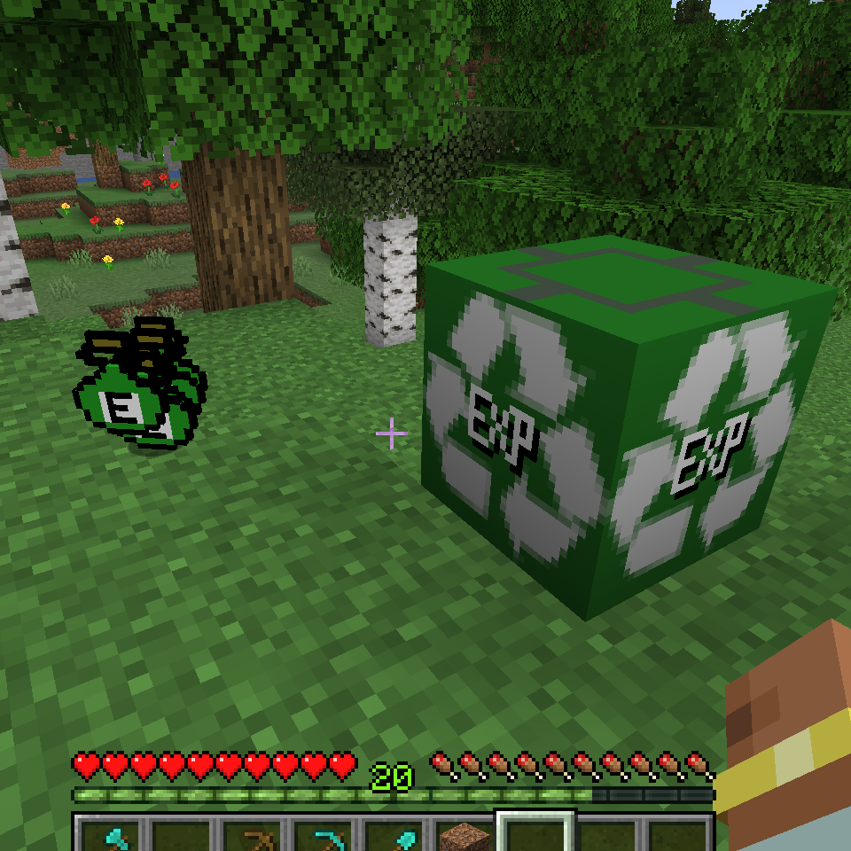

# mc_expbank
a small mod for mc-forge

## what's for
钓鱼是我最喜欢的mc玩法之一 
钓鱼给的大量经验在很多地方能够起到作用，但也在我和朋友们决定外出探险时让我产生一些担忧 
于是我想，能不能想办法把经验存起来呢？ 
外出之前把经验都存起来，不用担心意外损失，而回来需要使用的时候（比如铁砧）又可以取出来用，就太好了 
所以您现在看到的就是这样的一个模组了

## block and item

### expbank:exp_potion（经验药水）
每瓶可给予玩家100点经验值

### expbank:exp_packer（经验罐装机）
当玩家手持空的【水瓶】并右键点击罐装机，会按水瓶的数量x100扣除身上的经验，并且弹出相应数量的经验药水

## versions
- MC: 1.20.1
- forge: 47.0.45
 
如果这和您所游戏的版本不同，您可以下载此项目并在`gradle.properties`文件中作相应修改，最后编译成您自己的版本

## Thanks
感谢前辈们发布的开发教程
- [FledgeXu@mcbbs.net](https://www.mcbbs.net/home.php?mod=space&uid=3247777)
- [very_H@mcbbs.net](https://www.mcbbs.net/home.php?mod=space&uid=2739383)

感谢网友们在我开发过程中提供的帮助
- [无敌三脚猫@mcbbs.net](https://www.mcbbs.net/home.php?mod=space&uid=81021)
- [PercyDan@mcbbs.net](https://www.mcbbs.net/home.php?mod=space&uid=2154961)
- [碎影星@mcbbs.net](https://www.mcbbs.net/home.php?mod=space&uid=4446622)

## Licence
- This mod:  [MIT](./LICENSE)
- Forge: [Licence](./LICENSE.txt)

## README from forge-mdk
[link](./README-forge.txt)